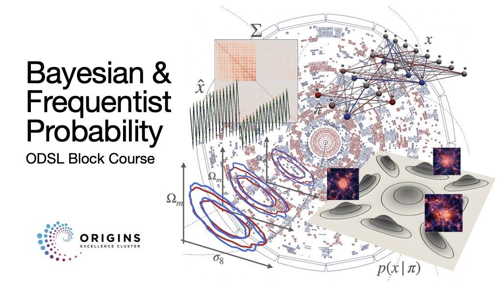

# Bayesian & Frequentist Probability

Slides, notebooks and exercises for the ODSL block course on Bayesian and frequentist statistics.

## What's here

- [Lectures](lecture_pdfs/) — the lecture slides.
- [Tutorials](tutorials/) — notebook exercises and worked solutions.
- [Handouts](handouts/) — short summaries of the lectures.
- The numbered folders, from [01_probability](01_probability/) to [08_hypothesis_testing](08_hypothesis_testing/), contain examples on probability, estimators, Fisher information, frequentist and Bayesian inference, covariance estimation, MCMC and hypothesis testing.
- The notebooks in the main folder contain extra worked examples, mostly using Gaussian and linear models.
- [Exam](exam/) — draft questions and solutions.
- [References](references.md) — books and papers for further reading.

## Tutorials

Start with [lecture one](lectures/01_introduction.key) and the [probability tutorial](tutorials/lecture_01_probability.ipynb).

Open the notebooks in Jupyter or VS Code and run the cells from top to bottom. The Python packages are listed in [requirements.txt](requirements.txt).
